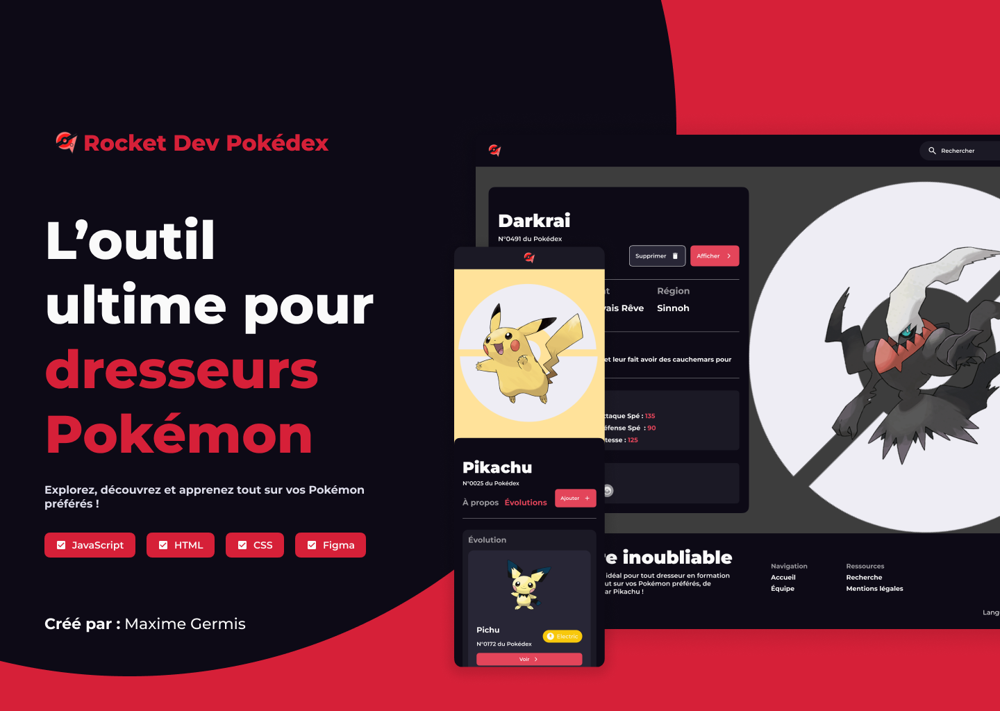

# La Rocket Dev Pokédex – L’outil web ultime pour tous les dresseurs Pokémon



## 🚀 Description

Le Pokédex de La Rocket Dev, l’outil idéal pour tout dresseur en formation ! Explorez, découvrez et apprenez tout sur vos Pokémon préférés, de Bulbizarre à Dracaufeu en passant par Pikachu !

## 🎨 Identité Visuelle et Maquette

- **Couleur principale :** Red : `#E3455A`
- **Couleur secondaire :** Noir : `#d52038`
- **Blanc :** `#FAFAFA`
- **Noir :** `#0D0A16`
- **Typographie :** `Montserrat`
- **Maquette :** [Maqette Figma](https://www.figma.com/design/m46aSEcedxuc0papLeVWOe/PROJECT_ROCKET_DEV?node-id=14019-7581&t=zLVlbdzQQ3uyaseh-1)

## ⚙️ API

- **API et Images :** [PokeAPI](https://pokeapi.co/)

## 🗂️ Ressources

- **Logo :** [Roundicons Freebies - Flaticon](https://www.flaticon.com/free-icons/pokemon")
- **Image de MissingNo :** [Poképédia - licence Creative Commons](https://www.pokepedia.fr/Fichier:Sprite_MissingNo._RV.png)
- **Icons :** [Font Awesome](https://fontawesome.com/)
- **Fonts :** [Google Fonts](https://fonts.google.com/specimen/Montserrat)

## 🔧 Technologies Utilisées

- **Frontend :** `HTML`, `CSS`, `JavaScript`
- **Outils :** `Prettier`, `Eslint`
- **Versionnage et détection :** `Git`, `GitHub`, `SonarQube`
- **Gestion de dépendances :** `npm`
- **PWA :** `Service Worker`, `Manifest`


## 📦 Installation

1. **Cloner le dépôt :**
    ```bash
    git clone https://github.com/Maxime422/ECF_ROCKET.git
    ```
2. **Se rendre dans le dossier du projet :**
    ```bash
    cd ECF_ROCKET
    ```
3. **Installer les dépendances :**
    ```bash
    npm install
    ```
4. **Lancer le projet :**
    ```bash
    npm start
    ```

## 🛠 Fonctionnalités

- ✅ Affichage et gestion de l’équipe de Pokémon (ajout, suppression, modification)
- ✅ Fonctionnalités de recherche de Pokémon
- ✅ Pages de consultation des Pokémon, affichant statistiques, images, talents, région,     évolutions, etc.
- ✅ Pokédex avec filtres par région et type de Pokémon
- ✅ Easter-eggs cachés à découvrir dans différents endroits
- ✅ Notifications d'événements importants (Easter eggs, niveaux, découvertes)
- ✅ Petites animations, changement de page, ajout ou suppression de Pokémon, ...

## 🚧 Améliorations Futures

- [ ] Ajouter d'autres Easter-eggs à découvrir
- [ ] Ajouter une carte interactive de la région avec les Pokémon associés
- [ ] Permettre la comparaison de différents Pokémon entre eux
- [ ] Ajouter des musique ou sons interactifs

## 🤝 Contribuer

1. **Forker** le projet
2. **Créer** une branche (`git checkout -b nouvelle-fonctionnalité`)
3. **Commiter** vos modifications (`git commit -m 'Ajout nouvelle fonctionnalité'`)
4. **Pousser** la branche (`git push origin nouvelle-fonctionnalité`)
5. **Ouvrir** une Pull Request

## 📞 Contact

Pour toute question, contactez-moi :

- **LinkedIn :** [Germis Maxime](https://www.linkedin.com/in/maxime-germis)
- **GitHub :** [Maxime422](https://github.com/Maxime422)

---

Fait avec ❤️ par [Maxime Germis](https://github.com/Maxime422)
